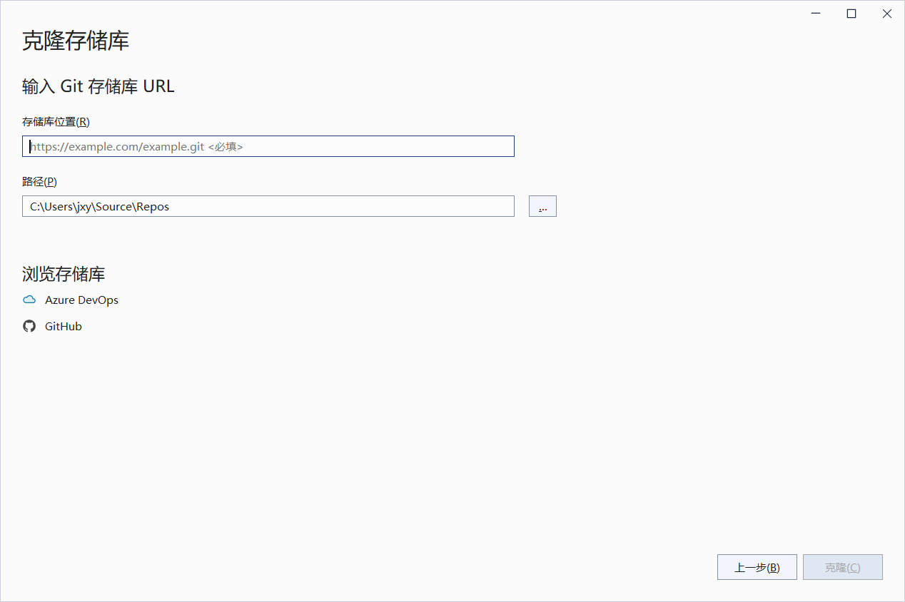
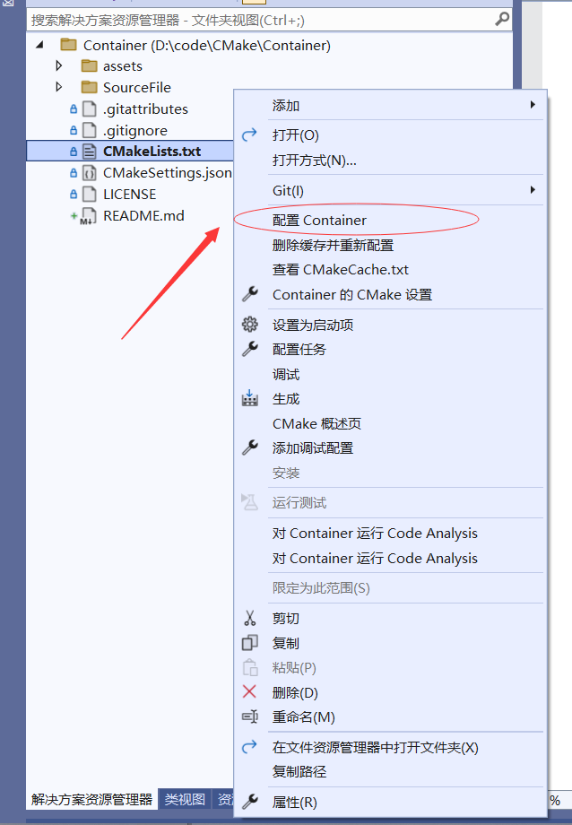
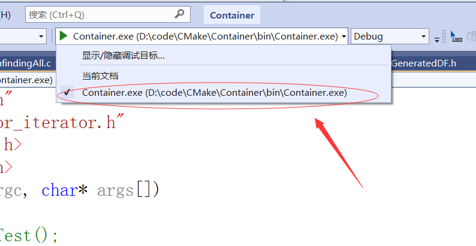

# 前言
## 基本介绍
+ 本项目使用**纯C**实现各种容器和算法(**<u>均是泛型</u>**)。

+ 本意是锻炼思维，顺道给C写一套容器供以后使用。

+  容器成员函数名都尽可能与C++中的**保持一致**，只要看几个样例就可以**快速上手**使用。

+  **但是**使用此代码对**指针**的掌握有一定的要求，有些时候会用到二级指针(**这个不多**)但**一级指针**必须会要用。

+  这里仅仅介绍各种**使用方法**，不做详细展开，帮助更好的**阅读源码**，欢迎一起**完善它**。
## 项目地址

[master](https://gitee.com/xin___yue/c-language-container/tree/master) (稳定版分支)

[develop](https://gitee.com/xin___yue/c-language-container/tree/develop)(开发板分支)

## 使用方法
1.选择一个[分支](##项目地址)
    
2.复制其HTTPS地址
    
3.打开VS
	1.开始使用
	2.克隆储存库


4.填入基本信息
	1.储存库位置:刚才**复制的HTTPS地址**，直接**粘贴**即可
	2.路径:在电脑上找到一个**目录**，新建一个文件夹后选择，一定要**空文件夹**


5.最后右下角**点击克隆**即可，VS会从网上将文件都下载下来

6.右键点击CMakeLists.txt**配置**一下



7.最后选中Container.exe**点击**即可运行



### CMake (C模板)

+ 在当前工程文件夹下，新建SourceFile文件夹，在其**SourceFile**文件夹下的**所有.c .h** 文件都将会**自动**添加并参与**编译**，可以在**其内嵌套**文件夹

+  每次**删除或添加**代码文件后，仅需右键CMakeLists.txt**重新配置**即可

```cmake
#请求CAMKE的最小构建版本
cmake_minimum_required(VERSION 3.5)
#设置项目名称
project(Container VERSION 0.1 LANGUAGES C)

set(CMAKE_INCLUDE_CURRENT_DIR ON)

set(CMAKE_C_STANDARD 99)
set(CMAKE_C_STANDARD_REQUIRED ON)


#自动查找头文件路径函数(没有去重)
macro(FIND_INCLUDE_DIR result curdir)  #定义函数,2个参数:存放结果result；指定路径curdir；
    file(GLOB_RECURSE children "${curdir}/*.hpp" "${curdir}/*.h" )	#遍历获取{curdir}中*.hpp和*.h文件列表
    message(STATUS "children= ${children}")								#打印*.hpp和*.h的文件列表
    set(dirlist "")														#定义dirlist中间变量，并初始化
    foreach(child ${children})											#for循环
        string(REGEX REPLACE "(.*)/.*" "\\1" LIB_NAME ${child})			#字符串替换,用/前的字符替换/*h
        if(IS_DIRECTORY ${LIB_NAME})									#判断是否为路径
            LIST(APPEND dirlist ${LIB_NAME})							#将合法的路径加入dirlist变量中
        endif()															#结束判断
    endforeach()														#结束for循环
    set(${result} ${dirlist})											#dirlist结果放入result变量中
endmacro()																#函数结束

#查找include目录下的所有*.hpp,*.h头文件,并路径列表保存到 INCLUDE_DIR_LIST 变量中
FIND_INCLUDE_DIR(INCLUDE_DIR_LIST "SourceFile")			#调用函数，指定参数
#将INCLUDE_DIR_LIST中路径列表加入工程		
include_directories(${INCLUDE_DIR_LIST})
#递归搜索目录下的文件添加到变量中
file(GLOB_RECURSE FILE "SourceFile/*.c" "SourceFile/*.h")

#设置图标
#aux_source_directory(. MY_SCOURCES)
#设置可执行文件的输出目录
set(CMAKE_RUNTIME_OUTPUT_DIRECTORY ${CMAKE_CURRENT_LIST_DIR}/bin)
#添加参加编译的文件
add_executable(${PROJECT_NAME}
${FILE}
 )
```


# 目录

## 容器
### XContainerObject(容器-基类)
#### 说明
> 这个基本不会直接使用，不做详细展开，仅做介绍

#### 结构体定义
```c
//容器基类
typedef struct XContainerObject
{
	//判断函数
	const bool (*empty)(const struct XContainerObject*);// 检测容器是否为空，空为真 O(1)
	//大小函数
	const size_t(*size)(const struct XContainerObject*);//返回容器内元素的个数 O(1)
	const size_t(*capacity)(const struct XContainerObject*); //返回当前容器所能容纳的最大元素值
	//其他函数
	void (*swap)(struct XContainerObject*, struct XContainerObject*);//交换两个同类型容器的数据
	void* _data;//指向容器数据的指针
	size_t  _capacity;//当前容器能容纳的最大元素数量
	size_t _size;//当前容器内的元素个数
	size_t _type;//类型占用字节数
}XContainerObject;
```

#### 初始化容器XContainerObject的基本数据

```c
void XContainerObject_init( struct XContainerObject* Object,size_t type);
```
#### 判断容器是否为空，空返回true
```c
const bool XContainerObject_empty(const struct XContainerObject* Object);
```
#### 返回容器当前的元素数量
```c
const size_t XContainerObject_size(const struct XContainerObject* Object);
```
#### 返回容器当前状态可以容纳的最大值(当前为数据准备的内存大小)
```c
const size_t XContainerObject_capacity(const struct XContainerObject* Object);
```
#### 返回容器内单个元素的大小(字节)
```c
const size_t XContainerObject_type(const struct XContainerObject* Object);
```
#### 交换两个相同类型的容器
```c
void XContainerObject_swap(struct XContainerObject* ObjectOne, struct XContainerObject* ObjectTwo);
```
### XList(链表)
[^this_list]:链表指针
[^LPValue]:数据的内存地址 
[^curNode]:指定的节点指针 
#### 插入

##### 链表头部增加一个元素

1[^this_list] 2[^LPValue]

```C
 XListNode* XList_push_front(struct XList* this_list, void* LPValue);
```
##### 链表尾部增加一个元素
1[^this_list] 2[^LPValue]

```c
XListNode* XList_push_back(struct XList* this_list, void* LPValue);
```
##### 链表指向的节点前插入多个
1[^this_list] 2[^curNode]

```c
void  XList_insert_front_p(struct XList* this_list,XListNode* curNode, ...);
//curNode后不填个数默认一个，最大一次1000个
```
##### 链表指向的节点前插入一个数组的数据(可插入单个数据)
1[^this_list] 2[^curNode]

```c
void  XList_insert(struct XList* this_list,XListNode* curNode, const void* begin, const void* end);
//begin与end相同时插入一个数据
```

#### 删除
##### 链表删除头节点

1[^this_list] 

```C
void  XList_pop_front(struct XList* this_list);
```
##### 链表删除尾节点

1[^this_list] 

```C
void  XList_pop_back(struct XList* this_list);
```
##### 链表删除一个区间内的节点(可以删除一个节点)

1[^this_list] 

```C
void  XList_erase_p(struct XList* this_list, const XListNode* begin, const XListNode* end);
//begin与end相同时删除同一个节点
```
##### 链表清空节点

1[^this_list] 

```C
void  XList_clear(struct XList* this_list);
```

#### 遍历
##### 链表返回其头节点

1[^this_list] 

```C
XListNode* XList_front(struct XList* this_list);
```
##### 链表返回其尾节点

1[^this_list] 

```C
XListNode* XList_back(struct XList* this_list);
```
##### 链表根据元素查找其节点

1[^this_list] 

```C
XListNode* XList_find(const struct XList* this_list, XEquality equality, const void* findVal);
//equality是一个判断相等的比较准则，回调函数
//findVal 查找元素的指针
```
#### 判断
##### 链表是否为空

1[^this_list] 

```C
bool  XList_empty(const struct XList* this_list);
```
#### 其他
##### 链表返回其元素个数(节点个数)

1[^this_list] 

```C
size_t   XList_size(const  struct XList* this_list);
```
##### 链表排序

1[^this_list] 

```C
void  XList_sort(struct XList* this_list, XCompare compare);
//compare比较准则-回调函数
```
##### 交换两个相同类型的链表

1[^this_list] 

```C
void  XList_swap(struct XList* this_listOne, struct XList* this_listTwo);
```
##### 释放链表

1[^this_list] 

```C
void  XList_free(struct XList* this_list);
```
##### 创建初始化链表


```C
struct XList* XList_init(int TypeSize);
//TypeSize单元素的大小-字节
```
#### 链表迭代器
##### 链表正向迭代器
###### 链表正向迭代器开始的位置
1[^this_list] 

```C
XList_iterator* XList_begin(struct XList* this_list);
```
###### 链表正向迭代器结束的位置
1[^this_list] 

```C
XList_iterator* XList_end(struct XList* this_list);
```
###### 链表正向迭代器做++运算
1[^this_list] 

```C
XList_iterator* XList_iterator_add(struct XList* this_list, XList_iterator*it);
//注意因为是一级指针一定要接收函数的返回值
```
###### 链表用正向迭代器做遍历操作
1[^this_list] 

```C
void XList_iterator_for_each(struct XList* this_list, XFor_each ForFunction, void* args);
//ForFunction 传入做遍历操作的回调函数
//args传给回调函数的参数指针，不使用时直接NULL
```
##### 链表反向迭代器
###### 链表反向迭代器开始的位置
1[^this_list] 

```C
XList_reverse_iterator* XList_rbegin(struct XList* this_list);
```
###### 链表反向迭代器结束的位置
1[^this_list] 

```C
XList_reverse_iterator* XList_rend(struct XList* this_list);
```
###### 链表反向迭代器做++运算
1[^this_list] 

```C
XList_reverse_iterator* XList_reverse_iterator_add(struct XList* this_list, XList_reverse_iterator* it);
//注意因为是一级指针一定要接收函数的返回值
```
###### 链表用反向迭代器做遍历操作
1[^this_list] 

```C
void XList_reverse_iterator_for_each(struct XList* this_list, XFor_each ForFunction, void* args);
//ForFunction 传入做遍历操作的回调函数
//args传给回调函数的参数指针，不使用时直接NULL
```
#### 链表使用样例

```C
#include"XList.h"//链表容器的头文件
#include"XEquality.h"//判断相等的回调函数库
#include"XCompare.h"//比较大小的回调函数库-包括大于，小于，相等
#include<time.h>
#include<stdio.h>
#include<stdlib.h>
//链表迭代器遍历的回调函数
void ListFor_each(void* LPVal, void* args)
{
	printf("%d ",*(int*)LPVal);
}
//链表排序的测试
void ListSortTest()
{
	XList* li = XList_init(sizeof(int));
	int size = 1000000;
	srand((unsigned int)time(NULL));
	int* p1 = malloc(sizeof(int) * size);
	for (size_t i = 0; i < size; i++)
	{
		int num = rand() % 1000;
		li->push_back(li,&num);//尾插
	}
	clock_t  time_front = clock();
	XList_sort(li, XLess_int);
	clock_t time_after = clock();
	printf("%d随机数，链表排序运行了%dms\n", size, time_after - time_front);
	li->free(li);
}
//链表的迭代器测试
void ListIterator()
{
	XList* li = XList_init(sizeof(int));
	int arr[] = { 123,12,1,4,9 };
	for (size_t i = 0; i < sizeof(arr) / sizeof(arr[0]); i++)
	{
		XList_push_back(li, arr + i);
	}
	printf("开始正向遍历\n");
	for (XList_iterator* it = XList_begin(li); it != XList_end(li); it = XList_iterator_add(li, it))
	{
		printf("%d\n", *(int*)((XListNode*)it)->date);
	}
	printf("开始反向遍历\n");
	for (XList_reverse_iterator* it = XList_rbegin(li); it != XList_rend(li); it = XList_reverse_iterator_add(li, it))
	{
		printf("%d\n", *(int*)((XListNode*)it)->date);
	}
	XList_free(li);
}
//链表的基本函数测试
void ListTest()
{
	XList* list = XList_init(sizeof(int));
	
	int arr[] = { 123,12,1,4,9 };
	for (size_t i = 0; i < sizeof(arr)/sizeof(arr[0]); i++)
	{
		XList_push_back(list,arr+i);
	}
	int x = 100;
	//li->insert_front_int(li, 0, &x, 10);
	printf("元素遍历\n");

	XList_iterator_for_each(list, ListFor_each,NULL);//迭代器遍历输出
	printf("\n");
	printf("头元素为：%d\n", *(int*)list->front(list)->date);
	printf("尾元素为：%d\n", *(int*)list->back(list)->date);

	XListNode*findNode=XList_find(list, XEquality_int, arr +2);
	printf("找到的数字%d\n", *(int*)findNode->date);


	/*li->pop_back(li);
	li->pop_back(li);
	li->pop_front(li);
	li->pop_front(li);*/
	//li->erase_p(li,li->find(li,num+1), li->find(li,num+5));
	list->erase_int(list,1, 8);
	printf("删除元素后遍历\n");
	for (size_t i = 0; i < list->size(list); i++)
	{
		printf("%d\n", *(int*)list->at(list, i)->date);
	}
	list->free(list);
}
//交换函数测试
void ListSwapTest()
{
	XList* li1 = XList_init(sizeof(int));
	int num;

	for (size_t i = 0; i < 10; i++)
	{
		num = i;
		li1->push_front(li1, &num);
	}
	printf("li1元素遍历\n");
	for (size_t i = 0; i < li1->size(li1); i++)
	{
		printf("%d\n", *(int*)li1->at(li1, i));
	}

	XList* li2 = XList_init(sizeof(int));

	for (size_t i = 0; i < 20; i++)
	{
		num = 20 - i;
		li1->push_front(li2, &num);
	}
	printf("li2元素遍历\n");
	for (size_t i = 0; i < li1->size(li2); i++)
	{
		printf("%d\n", *(int*)li1->at(li2, i));
	}

	li1->swap(li1, li2);

	printf("交换后li1元素遍历\n");
	for (size_t i = 0; i < li1->size(li1); i++)
	{
		printf("%d\n", *(int*)li1->at(li1, i));
	}

	printf("交换后li2元素遍历\n");
	for (size_t i = 0; i < li1->size(li2); i++)
	{
		printf("%d\n", *(int*)li1->at(li2, i));
	}
	li1->clear(li1);
	li1->clear(li2);
}
```


### XVector(动态数组)
### XString(字符串)
### XStack(栈)
### XMap(映射)
### XQueue(队列)
### XPriority_Queue(优先队列)
## 算法
### 二叉树
#### XBinaryTreeObject(二叉树-基类)
#### 平衡二叉树
#### 红黑树
### 迷宫
#### XMaze(迷宫-基类)
#### 迷宫生成
##### 深度优先迷宫生成算法
#### 迷宫寻路
##### 深度优先寻路算法
##### 广度优先寻路算法
##### A*寻路算法
### 排序
#### 直接插入排序
#### 希尔排序
#### 直接选择排序
#### 堆排序
#### 冒泡排序
#### 快速排序
#### 归并排序
#### 随机打乱顺序
### 查找
#### 二分查找
### 其他
#### swap(交换数据) 
#### XDelay(延迟函数，多平台)

